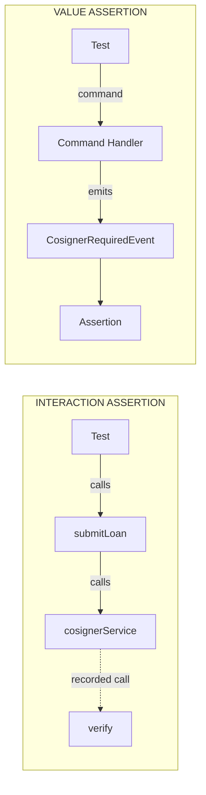
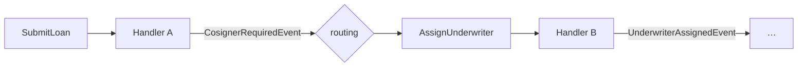

# Assert on What Happened, Not on Who Was Called: Black-Box Testing in Event-Sourced Systems

Every codebase has a function like the one I am about to show you. It started as three lines of conditional logic, then a regulation changed, then a second product type arrived, and now it crosses half a screen. It looks important. Skipping tests on it would feel irresponsible, so it gets a test class of its own, almost without thinking.

That reflex is usually explained by complexity, and that explanation is wrong. What decides whether you end up writing white-box tests is not how complicated your code is. It is whether the business outcome exists anywhere as a value you can point at. This article follows one rule from the inside of a helper to the outside of a system to show you the difference, and event sourcing turns out to matter for a reason that has nothing to do with fashion.

<!-- more -->

## A Rule Worth Testing

Take a function that decides whether a loan application needs a cosigner. Banks are a good source of rules with the right shape, because they combine numeric thresholds, regulatory cutoff dates, and product types that each behave a little differently. Call it `isHighRiskAutoLoan(Loan loan)` and have it return a boolean. The whole rule fits on one screen, which is exactly what makes it tempting.

A short detour through the vocabulary first, because not everyone works in lending and the rule is unreadable without it. A **cosigner** is a second person who guarantees the loan and becomes liable if the borrower stops paying, so requiring one is the bank's way of accepting a risk it would otherwise decline. The **principal** is the money actually borrowed, before any interest. The three loan types in the code are three different situations a customer can be in: a **conventional** loan is new money, a **refinance** replaces an existing loan with a fresh one, and a **restructuring** keeps the loan but renegotiates the repayment schedule.

Those three situations carry different numbers, which is why the rule cannot simply read one field and compare it. A conventional loan has a single principal. A refinance has two of them, the one being paid off and the one being taken on, and the bank cares about both. A restructuring has neither, because nothing is being borrowed; what exists is a schedule, so the interesting figure is the size of the individual instalments.

```java
static boolean isHighRiskAutoLoan(Loan loan) {
    if (loan.kind() != LoanKind.AUTO) {
        return false;
    }

    boolean exceedsThreshold = switch (loan) {
        case Loan.Conventional c -> c.principal().compareTo(THRESHOLD) > 0;
        case Loan.Refinance r -> r.currentPrincipal().compareTo(THRESHOLD) > 0
                || r.plannedPrincipal().compareTo(THRESHOLD) > 0;
        case Loan.Restructuring s -> s.instalments().stream()
                .anyMatch(instalment -> instalment.compareTo(THRESHOLD) > 0);
    };

    if (!exceedsThreshold) {
        return false;
    }
    if (loan instanceof Loan.Restructuring) {
        return true;
    }
    return loan.contractDate().isAfter(LocalDate.of(2023, 12, 31));
}
```

You can see all three shapes in the switch. The conventional case is one comparison, the refinance case is two joined by an or, and the restructuring case walks a list and asks whether any element crosses the line. Three branches, three different meanings of the same threshold, and none of them reducible to the others.

Then there is the cutoff date, because the regulation that introduced this check applies only to contracts signed from 2024 onward. Restructurings are exempt from that date entirely, which is the kind of carve-out that regulations produce and developers inherit. You can count the test cases straight off the code: three loan types, three positions around the threshold, three around the cutoff, minus the combinations the exemption removes. That lands somewhere between twenty and thirty cases before you sleep well at night.

## So You Test It

Testing this is the easy part, and that is worth saying out loud before anything else. A `Loan` goes in, a boolean comes out, and nothing in between touches a database, a queue, or a clock. You write `HighRiskAutoLoanTest`, you give it twenty methods, and every one of them is three lines long. No infrastructure, no setup, no doubles.

```java
@Test
void conventional_auto_loan_above_the_threshold_is_high_risk() {
    var loan = conventionalAutoLoan(BigDecimal.valueOf(50_001), LocalDate.of(2024, 1, 2));

    assertThat(isHighRiskAutoLoan(loan)).isTrue();
}

@Test
void conventional_auto_loan_exactly_at_the_threshold_is_not() {
    var loan = conventionalAutoLoan(BigDecimal.valueOf(50_000), LocalDate.of(2024, 1, 2));

    assertThat(isHighRiskAutoLoan(loan)).isFalse();
}
```

Twenty cases later the suite is green and the coverage report agrees with you. Now ask what those tests actually prove. They prove that `isHighRiskAutoLoan(...)` returns the right boolean for the inputs you handed it, which is a real thing to know and a smaller thing than it feels like. They say nothing about whether anyone calls the function, whether the result is used the right way around, or whether a cosigner requirement ever reaches the applicant.

There are at least three layers between this boolean and the person filling out the form. A command handler takes the submission and decides what happens next. A precondition ties the boolean to whether the cosigner field appears at all. A role check governs who may write into that field once it does. Ship a refactoring that quietly disconnects the rule from its caller and every test in `HighRiskAutoLoanTest` still passes, because **the helper is correct in isolation while the system is silently broken.**

## Then You Open the Caller

So you decide to test the caller as well, which is the obvious next move and the reason this article exists. In a layered backend the caller is a service method, and it does the sort of thing service methods do. It loads the applicant, persists the application, and then branches on the rule.

```java
public void submitLoan(LoanRequest request) {
    var applicant = applicantRepository.find(request.applicantId())
            .orElseThrow(() -> new NoSuchApplicantException(request.applicantId()));

    applicationRepository.save(new LoanApplication(request));

    if (isHighRiskAutoLoan(request.loan())) {
        cosignerService.require(applicant, request);
        underwritingService.assignReviewer(request);
    } else {
        approvalService.approve(request);
    }
}
```

Look at the signature again. It returns `void`. You came here to assert that a high-risk application requires a cosigner, and there is nothing to assert on, because the sentence "this application requires a cosigner" is not data anywhere in this design. It exists as the fact that a particular method was called on a particular service, and nowhere else.

So you reach for Mockito, and you do it without thinking, the same way you wrote the helper test without thinking. There is no decision being made here. There is nothing else in the room to reach for.

```java
@Test
void requires_a_cosigner_when_auto_loan_exceeds_the_threshold_after_the_cutoff() {
    when(applicantRepository.find(applicantId)).thenReturn(Optional.of(applicant));

    service.submitLoan(new LoanRequest(applicantId,
            conventionalAutoLoan(BigDecimal.valueOf(50_001), LocalDate.of(2024, 1, 2))));

    verify(cosignerService).require(eq(applicant), any());
    verifyNoInteractions(approvalService);
}
```

The name of that test is a business requirement. The assertion underneath it is not. `verify(cosignerService).require(...)` claims that a method with that name was invoked on a service of that type, which is a claim about the shape of your code rather than about what the system did. Rename `require` to `requireFor` and the test goes red while the behavior stays identical. Move the branch into a different service and it goes red again.

That is the whole point, and it is worth being precise about it. The helper test was white-box because you chose it. This one is white-box **by construction**, because the design offers no value to assert on and a claim about calls is the only claim available. Which brings back the pressure you felt reading the rule at the top: it never came from the complexity. `isHighRiskAutoLoan(...)` is the most intricate code in either listing and the easiest thing in either one to test at any level you like, while the eight trivial lines of orchestration around it are the part that resists testing.

## The Same Rule, One Layer Up

Now put the same rule into a command handler and change nothing about the logic. The branch is still there, the helper is still called from it, and the two outcomes are still the two outcomes. What changes is what the branch reaches for when it has decided.

```java
@CommandHandling
public void submitLoan(
        Applicant applicant,
        SubmitLoanCommand command,
        CommandEventPublisher<Applicant> publisher) {
    if (isHighRiskAutoLoan(command.loan())) {
        publisher.publish(new CosignerRequiredEvent(command.applicantId()));
    } else {
        publisher.publish(new LoanApprovedEvent(command.applicantId()));
    }
}
```

Requiring a cosigner is no longer something the handler does to a service. It is something the handler states, as a record, and the record contains the whole outcome. That distinction is finer than it looks, because `publisher.publish(...)` is structurally the same outward call as `cosignerService.require(...)` was. The difference lives in the argument: `CosignerRequiredEvent` is the complete business outcome expressed as data, while `require(applicant, request)` is an instruction whose meaning only materializes inside the thing you called.

Because the outcome is data, the test can read it. The fixture replays whatever happened before, runs the command, and hands you the events that came out.

```java
@Test
void requires_a_cosigner_when_auto_loan_exceeds_the_threshold_after_the_cutoff() {
    fixture.given()
        .events(new ApplicantOnboardedEvent(applicantId, "creditworthy"))
        .when(new SubmitLoanCommand(applicantId,
            conventionalAutoLoan(BigDecimal.valueOf(50_001), LocalDate.of(2024, 1, 2))))
        .succeeds()
        .allEvents().single(e -> e.ofType(CosignerRequiredEvent.class));
}

@Test
void does_not_require_a_cosigner_at_exactly_the_threshold() {
    fixture.given()
        .events(new ApplicantOnboardedEvent(applicantId, "creditworthy"))
        .when(new SubmitLoanCommand(applicantId,
            conventionalAutoLoan(BigDecimal.valueOf(50_000), LocalDate.of(2024, 1, 2))))
        .succeeds()
        .allEvents().none(e -> e.ofType(CosignerRequiredEvent.class));
}
```

The loan expression in those tests is the one from the Mockito test, unchanged. Same input, same dimensions, same number of cases. Only the assertion moved, and the two versions of it are worth putting side by side, because everything in this article sits in the difference between these two lines.

```java
verify(cosignerService).require(eq(applicant), any());     // who was called
.single(e -> e.ofType(CosignerRequiredEvent.class));       // what happened
```

The first line survives no restructuring of the code it describes. The second survives all of it. Rename the handler, inline the rule, split the class in two, move the branch: the claim still holds, because the claim was never about any of that in the first place.



The dotted line in the upper half is the part that should bother you. Your assertion is not reading an output; it is reading a note that a test double took about being poked.

## What a Value Assertion Can Do That a Call Assertion Cannot

Two things follow from asserting on a value, and both of them are easy to walk past. The first is that a value assertion can be complete. `verify(a)` followed by `verify(b)` checks the two things you remembered to check, and an unwanted call to `underwritingService.assignReviewer(...)` in the wrong branch sails through, because no test asked about it. Mockito offers `verifyNoMoreInteractions` for exactly this, and in practice it is opt-in, breaks whenever anything unrelated is added, and gets deleted the first time it is inconvenient.

With events the emitted list is in your hands in its entirety, so completeness costs a single line. You can claim that one specific event came out and nothing else did, or that a particular kind of event did not occur at all, and neither claim requires you to have anticipated which wrong thing might happen.

```java
.allEvents().exactly(new CosignerRequiredEvent(applicantId));
```

The second consequence is that nothing stands between the test and the real artifact. `verify` proves that a call reached the double you put in place of `CosignerService`, and the real implementation never runs, which sounds obvious until you follow it through. Suppose someone changes `CosignerService.require(...)` so the cosigner field is only made mandatory for natural persons, having misread a ticket about legal entities. The helper test stays green because the rule is untouched, the Mockito test stays green because the call still happens, and the business rule is now false for every company that applies.

Stubbing a return value does not close that gap; it widens it, because you then assert against your own hypothesis about what the service gives back. An event has no such gap. The record the test inspects is the record the system appends, built by the same code and replayed through the same state-rebuilding handlers, so the thing you assert on is the thing production produces.

The fixture leans into this with deliberately strict assertion verbs. `single()` means there was exactly one event and it matched, `once()` means exactly one match in a stream of any length, `every()` and `any()` and `none()` mean what they say, and `exactly()` compares the whole emitted stream against a list of payloads. Those names were chosen so that a test with a business-requirement name gets an assertion that reads as the outcome you meant, rather than as a lookup into a framework manual.

## Why This Stays Cheap

If black-box tests are better, the obvious question is why anyone writes helper tests at all, and the honest answer is cost. Look back at `submitLoan` and count the bill: one stubbed repository going in, three verified services coming out, and every one of those doubles has to be maintained as the layer beneath it changes. The cheapest in-memory alternative is a half-mocked variant that drifts a little further from production with each release.

So teams settle, and each individual act of settling is reasonable. Helper tests fit in one file and need no infrastructure at all. The integration tests will catch the wiring, people say, and sometimes the integration tests do catch it, and sometimes the wiring ships broken because those tests only walk the happy path. Stack enough reasonable decisions on top of each other and the suite stops meaning anything.

Event sourcing changes the arithmetic rather than the argument. A command handler takes typed inputs, namely the prior events and a command, and produces typed outputs, namely new events and possibly a return value. None of that needs infrastructure, so the fixture replays the prior events in memory, runs the handler, and captures what came out. A black-box test now costs roughly what constructing a few records costs.

This property is not exclusive to event sourcing, and pretending otherwise would be a cheap sell. Any design where the business rule sits between plain data in and plain data out gets a version of it, and a functional core with an imperative shell gets most of it. The difference is that those designs *permit* the property while event sourcing *enforces* it, because there is no way to express an effect other than as an event, so it cannot quietly decay the week somebody is in a hurry.

## The Given Makes You Learn the Process

Everything so far has been about the assertion, and there is a second difference hiding in the setup. To write the fixture test you had to produce this line: `given().events(new ApplicantOnboardedEvent(applicantId, "creditworthy"))`. That line demands that you know which facts must already be true before the rule can apply, and it demands them in the vocabulary of the domain rather than of your code.

The mock version demands nothing of the kind. `when(applicantRepository.find(id)).thenReturn(applicant)` puts a state into the world by fiat, and whether the system could ever have arrived at that state is not the test's problem and never becomes anyone's problem. You can write that line knowing a repository signature and nothing whatsoever about how a loan application comes to exist. It will pass, and it will keep passing, and it will teach you nothing.

I want to concede the obvious objection before someone raises it, because it is a fair one. Both setups are fabricated, and a prior event stream is no more real than a stubbed repository. The asymmetry is not about realism; it is about what each fabrication asks of the person writing it. One asks for a sequence of domain facts, the other asks for a return type.

That gives you a diagnostic you can run this afternoon without changing a line of code. Take a business rule your team owns and try to write down the events that must have happened before it applies. Either it comes out fluently and you know your process, or you have to go ask a colleague and the test just found a knowledge gap at your desk rather than in production, or nobody on the team can name the events at all, which is a modeling problem the test merely surfaced. The effort is real, and it is worth noting that you pay it once per process while you work out what the prelude is, not once per test case afterward.

## Every Handler Is Such a Boundary

The strongest objection to everything above is that real processes are not one method call. A loan application moves through creditworthiness checks, underwriting, escalation, and approval, and testing each step in isolation is exactly the trap that mock-heavy suites fall into. If your tests verify each step against a fabricated neighbor, they verify nothing about the process that connects them.

That objection lands hard against layered code and glances off event sourcing, and the reason is worth spelling out. Each handler in the chain is a boundary of the same kind: prior events in, new events out, outcome as a value. Handler A emits an event, handler B declares that event in its `given`, and the seam between them is a typed record that A genuinely produces rather than an interface you invented for the convenience of a test.



Two honest residues remain, and I would rather name them than let a careful reader find them. The first is that nothing checks that A really emits what B's `given` assumes. You share the type, which is already more than a mock offers you, but whether A ever emits that event, and with which subject, is a question neither test asks. The second is that the thing routing one handler's event into the next command is itself a component, and neither handler test covers it.

Both residues point at the same remedy rather than at a hole in the argument. The routing component has its own boundary, with its own inputs and its own observable output, so it gets tested the same way everything else here does. A five-step process is five places where the outcome exists as a value, which makes the property scale with the process instead of breaking on it.

## Where White-Box Tests Keep Their Place

None of this makes helper tests wrong, and I want to be blunt about that, because the argument is easy to over-apply. Those twenty to thirty threshold and cutoff combinations do not belong at the command boundary. Twenty-five of them would re-verify identical wiring with the same prelude copied above each one, which is noise dressed up as thoroughness. Extract the rule into its own small service and test it directly.

```java
@Test void conventional_auto_loans_above_50000_eur_are_high_risk() { ... }
@Test void contracts_signed_before_the_2024_cutoff_are_never_high_risk() { ... }
@Test void restructurings_ignore_the_cutoff_date_entirely() { ... }
```

Those names are business requirements, sitting on isolated unit tests of a boolean function, which closes off a shortcut worth naming. You cannot tell a white-box test from a black-box test by reading its name. Names tell you whether the author was thinking in requirements or in implementation, which is worth knowing and is a considerably smaller claim than the one people usually make with it.

The division of labor follows from that. Isolated tests carry the combinatorics, and three or four black-box tests carry the thing the isolated ones structurally cannot show, namely that the rule is connected to the system and that connecting it has consequences. Let the real rule run in those three or four, rather than substituting it for a fixed answer. It is a pure function with no dependencies, so running it costs nothing, and a test that decides the outcome up front is no longer testing the connection you wrote it for.

Genuinely internal mechanics keep their own tests without any of this applying to them. A parser, a formatter, a validator with intricate rules of its own: `parsesIsoDateWithTrailingZulu` says exactly what it verifies, and no outcome-level test says it better.

## What This Doesn't Buy You

The contract documents, the notification mail, the reporting call: none of that vanished when `cosignerService.require(...)` became `CosignerRequiredEvent`. Those effects moved into handlers and projections that react to the event, which is why the command handler test is clean. The effects were pushed out of the unit under test, not out of the system.

Which means those handlers need tests of their own, and this is where the argument gives something back. Testing the handler that sends the approval mail means putting a double in front of the mail gateway and verifying that it was called, because at that boundary a call really is the outcome and `verify` is the honest assertion. The technique you just spent an article learning to avoid is the right technique one layer out.

So the accounting is straightforward and not entirely free. One weak test became two strong ones, and the second one still has to be written. What you gained is that each of them now sits at a boundary where the thing it claims is the thing that happens.

## Where This Leaves You

Strip away the event sourcing and a short instruction survives. Find the point in your architecture where the business outcome exists as a value, the point where what the user wanted has either happened or not happened, and put your assertions there. Do not put them below it because the code below looks complicated, and do not put them below it because the code above is inconvenient to reach.

If the outcome exists as a value nowhere, and the only evidence that something happened is that a method was called, you have learned something about the design rather than about your test suite. That is not a gap to paper over with better mocks. A test suite is a downstream symptom of architectural choices, and treating the symptom rarely holds for long.

There is one mechanical question left open by all of this, and it is a fair one to ask. The fixture in these examples never opened a database, never started a container, and still reconstructed enough state to run a command handler against it. That works because of a construct called the `StateRebuildingHandlerDefinition`, which replays events through in-memory reducers to rebuild an instance on demand, and it deserves an article of its own.
