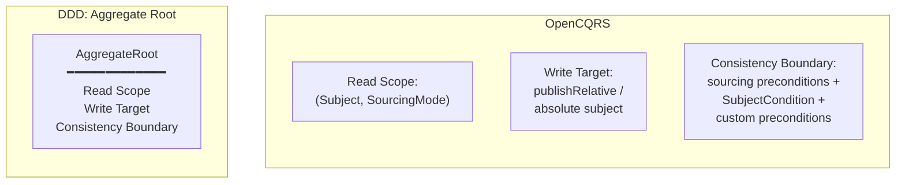
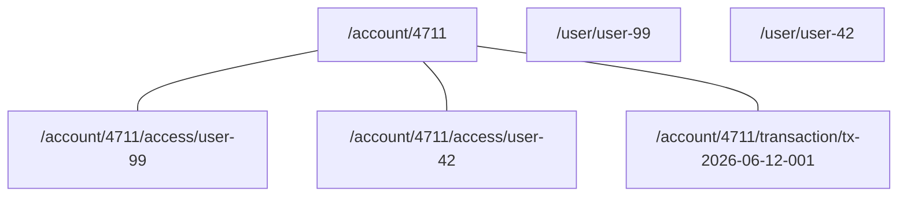
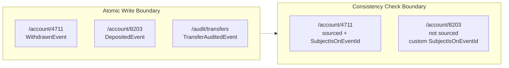
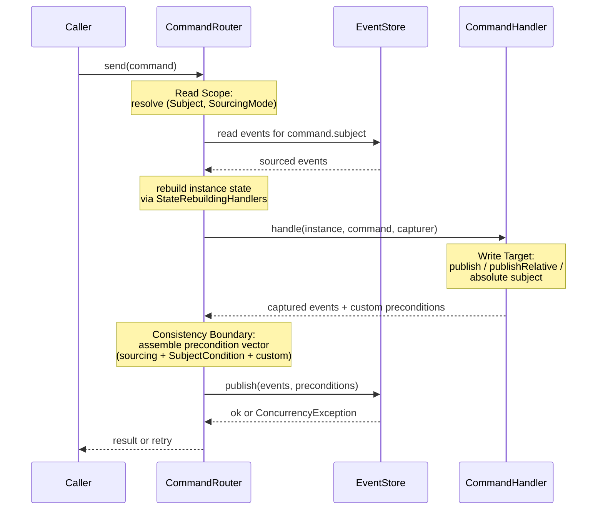

# Beyond the Aggregate Root: How OpenCQRS Decouples What the Aggregate Bundled Together

A few weeks ago, a colleague who was new to OpenCQRS asked a question in our team Slack. They were working on a shared bank account, where several users can have access to the same account, and they wanted to implement granting a user access.

Some background first. In OpenCQRS, every event is stored under a subject, a path like `/account/4711`. Every command has exactly one subject as well. Before the command handler runs, the framework loads the events stored under that subject and rebuilds the current state from them. The handler then makes its decision based on that state.

For the access grant, this led to a conflict. The new `AccessGrantedEvent` should be stored under the user's access entry, `/account/4711/access/user-99`. But the rules for granting access belong to the account: the account must exist, and there is a regulatory limit on how many users may sign for it. So the colleague asked: which subject should the command have? The one where the event ends up, or the one whose state the rules need?

If you know Domain-Driven Design, you know why this question seems to need exactly one answer. There, the Aggregate Root covers both: the events you read for a decision and the new events you write belong to the same Aggregate. OpenCQRS has no Aggregates. It splits the job of the Aggregate Root into three separate mechanisms, and once you look at them one by one, the question from the Slack thread answers itself.

In this article we look at what the Aggregate Root actually does, why OpenCQRS deliberately splits it up, and how its three parts become independent dimensions that each command can shape on its own.

<!-- more -->

## What the Aggregate Was Really Doing

The Aggregate Root is a well-established pattern. Eric Evans introduced it as a central part of tactical DDD (1), and Vaughn Vernon's *Implementing Domain-Driven Design* made it the standard way to apply the pattern. Many developers learned to model a domain by drawing boundaries, picking a root and routing every command through it. The pattern works for a clear reason: one type owns three things at the same time.
{ .annotate }

1.  Evans introduced the Aggregate Root in *Domain-Driven Design* (Addison-Wesley, 2003), the *Blue Book*. Vernon's *Implementing Domain-Driven Design* (Addison-Wesley, 2013), the *Red Book*, is the de-facto handbook for applying the pattern in production systems.

The first is the **anchor for state reconstruction**. When a command arrives, the framework loads the events of this Aggregate, replays them through the Aggregate class and hands you the reconstructed object. Which events to load is never a question, because the type settles membership: every event tagged with the Aggregate's identifier is loaded, and nothing else.

The second is the **target identity for new events**. When the Aggregate validates a command and emits events, they are written to the Aggregate's stream, so its identity is also the address of the new events. You never pick a destination.

The third is the **consistency boundary**, and this is the role people think about least. Inside the Aggregate, everything is transactionally consistent: the framework appends the new events only if nobody modified the Aggregate concurrently. Between Aggregates you have to accept eventual consistency. DDD treats the Aggregate as the unit of transactional safety, so this role is the strategic core of the pattern.

The following diagram shows the conflation. On the left, all three roles live inside one type. On the right, OpenCQRS provides them as three independent mechanisms:



Because all three roles share one identity, they look like a single concept. This is where the Slack question comes from: you look for the one identity to attach the access grant to, because the Aggregate model says such an identity always exists. The model hides the conflation so well that you only notice it once the Aggregate is gone.

## Read Scope - Where State Comes From

Without the Aggregate Root, the first role stands on its own. **[State reconstruction](../../../../reference/extension_points/state_rebuilding_handler/index.md)** in OpenCQRS is controlled by the **Read Scope**. It has two parts: the subject of the command instance and the `SourcingMode` of the command class. Both are values, not types, and both can differ per command type, even when two commands work on the same business object.

The subject is a hierarchical path such as `/account/4711`, `/account/4711/access/user-99` or `/account/4711/transaction/tx-2026-06-12-001`. The hierarchy has meaning for the framework: it knows that `/account/4711/access/user-99` lies below `/account/4711`. The `SourcingMode` then tells the framework how to use the subject when reading.

The examples in this article use a Shared Bank Account domain with the following subject tree:



Each account is the root of its own subtree, with access grants and transactions below it. Users have a separate hierarchy. Accounts do not own users and users do not own accounts. Their relationship is expressed through preconditions later, not through the path.

The `SourcingMode` enum is short enough to read in full (Javadoc tags rendered as text):

```java
public enum SourcingMode {

    /** No events will be fetched for the Command's subject. */
    NONE,

    /** Events will be fetched for the Command's subject non-recursively. */
    LOCAL,

    /** Events will be fetched for the Command's subject recursively. */
    RECURSIVE
}
```

A `GrantAccessCommand` with subject `/account/4711` and `RECURSIVE` loads the account plus every access grant and transaction below it. That is more than the handler strictly needs, but it is the scope that lets it count the signers and decide whether the new grant is allowed. A `DepositCommand` on the same subject with `LOCAL` loads only the account-level events. So the same business object gets two different read scopes. With an Aggregate Root you always loaded the whole instance, because the Aggregate *was* the unit of loading. In OpenCQRS each command decides this for itself.

## Write Target - Where Events Go

The second role of the Aggregate Root is the destination for new events. In OpenCQRS the **[command handler](../../../../reference/extension_points/command_handler/index.md)** sets the destination explicitly, and the command's subject is *not* automatically the destination. This sentence resolves the question from the Slack thread: **the command's subject is the read anchor, not the identity of the thing being modified**.

The handler receives a `CommandEventPublisher` to emit events. The interface offers two convenience families and one inherited fallback. `publish(event, ...)` writes the event to the command's subject. `publishRelative(subjectSuffix, event, ...)` appends a suffix to the command's subject and writes the event there. The inherited `publish(subject, event, ...)` takes any absolute subject.

```java
public interface CommandEventPublisher<I> extends EventPublisher {

    <E> I publish(E event,
                  Map<String, ?> metaData,
                  List<Precondition> preconditions);

    <E> I publishRelative(String subjectSuffix,
                          E event,
                          Map<String, ?> metaData,
                          List<Precondition> preconditions);

    // plus convenience overloads without metaData / preconditions
}
```

Back to the Slack question. A `GrantAccessCommand` is dispatched with subject `/account/4711`. The handler sources the account state and the existing grants recursively, checks that the new grant is allowed and calls `publishRelative("access/user-99", new AccessGrantedEvent(...))`. The event lands at `/account/4711/access/user-99`. The read scope is the account, the write target is a new subject one level deeper, and two separate mechanisms decide them independently.

??? tip "publishRelative is sugar"

    `publishRelative("access/user-99", event)` is a convenience method on top of `EventPublisher.publish(subject, event, ...)`, which the interface inherits from its parent. With that base method, a command handler can write to *any* absolute subject. Prefer `publishRelative` when the destination is a child of the command's subject, because then the call site shows the relationship. Use the absolute variant when the destination is outside the command's hierarchy, for example a system-wide audit log.

If the same handler also has to write an audit record, it uses this absolute method. The event goes to `/audit/access-changes`, completely outside the read scope of `/account/4711`. It is still part of the same atomic write batch as the access grant. No `StateRebuildingHandler` is applied to it, though, because it does not belong to the command's instance. So one command writes to two destinations in one atomic step.

## Consistency Boundary - What Must Not Change

The split is most visible in the third role, the consistency boundary. In the Aggregate model the type defines the boundary, and a version check on the Aggregate root enforces it. OpenCQRS has no typed root and therefore no Aggregate version. Instead, the consistency boundary is put together at runtime from three independent sources. All of them end up in a single vector of **[preconditions](../../../../reference/extension_points/command_handler/index.md)** that is attached to the atomic write.

The first source is the sourcing scope, and you get it for free. For every subject whose events the framework reads to reconstruct state, it automatically adds a `SubjectIsOnEventId` precondition to the write. The condition says: this subject must still be at the event id I saw when I read it, otherwise refuse the write. For every subject inside the sourcing scope that the handler writes to for the first time, it adds a `SubjectIsPristine` precondition: nobody may have touched this subject between my read and my write. You write no consistency code for either.

The second source is the command itself. `Command.SubjectCondition` is a declarative property on the command class: `NONE`, `EXISTS` or `PRISTINE`. The framework checks it before the handler runs and also adds a matching precondition to the atomic write. A `GrantAccessCommand` declares `EXISTS` on `/account/4711`, which means "refuse the command if no events have ever been recorded for this account". The framework checks this at sourcing time and enforces it as a `SubjectIsPopulated` precondition at publish time.

!!! warning "PRISTINE and EXISTS require non-NONE sourcing"

    The two declarative `SubjectCondition` checks, `PRISTINE` ("subject must be empty") and `EXISTS` ("subject must have at least one event"), only work if the framework actually reads events for that subject. With `SourcingMode.NONE` no events are sourced, so the framework cannot check the condition before the handler runs. Use `LOCAL` or `RECURSIVE` whenever the command declares anything other than `SubjectCondition.NONE`.

The third source shows the decoupling most clearly. Every captured event can carry its own preconditions through `CapturedEvent.preconditions()`. For example, the handler can attach `SubjectIsOnEventId("/user/user-99", lastSeenUserEventId)` to the access-granted event, and the condition is checked atomically with the write, even though `/user/user-99` was never in the sourcing scope. A typed Aggregate has no built-in way to do this. This fragment from `CommandRouter.send` shows how the three sources end up in one vector:

```java
// new subjects within sourcing scope -> SubjectIsPristine
List<Precondition> additionalPreconditions = events.stream()
        .map(CapturedEvent::subject)
        .filter(subject -> /* subject is inside sourcing scope */)
        .filter(subject -> !sourcedSubjectIds.containsKey(subject))
        .map(Precondition.SubjectIsPristine::new)
        .collect(toList());

// declarative SubjectCondition -> SubjectIsPristine or SubjectIsPopulated
switch (command.getSubjectCondition()) {
    case PRISTINE -> additionalPreconditions.add(
        new Precondition.SubjectIsPristine(command.getSubject()));
    case EXISTS   -> additionalPreconditions.add(
        new Precondition.SubjectIsPopulated(command.getSubject()));
}

// every sourced subject -> SubjectIsOnEventId at the last seen id
sourcedSubjectIds.entrySet().stream()
        .map(e -> new Precondition.SubjectIsOnEventId(e.getKey(), e.getValue()))
        .collect(toCollection(() -> additionalPreconditions));

// custom per-event preconditions
events.stream()
        .flatMap(e -> e.preconditions().stream())
        .collect(toCollection(() -> additionalPreconditions));

immediateEventPublisher.publish(events, additionalPreconditions);
```

This code has no Aggregate version, no shared root and no global lock. The vector simply lists what must still be true at write time, collected step by step from the command and from what the handler did. The framework passes the vector and the events to one atomic publish call, and the event store either accepts the whole batch or rejects it.

## When Subjects Don't Share a Hierarchy

So far the examples were easy. Accounts and their access grants share a subject path, and sourcing `/account/4711` recursively gives you everything you need to validate a new grant. This is also the case where DDD's Aggregate Root works well: a parent and its children with a clear boundary.

The harder case is coordination that cannot be reduced to one decision: several instances each have their own write-side rule, each rule can fail independently, and a failure in a later step needs explicit compensation. DDD solves this with Sagas, and OpenCQRS does the same, through choreography of commands and compensating events. **A worked Saga example in OpenCQRS, and the question of when you really need one, deserve their own article.**

??? info "A worked Saga example"

    The OpenCQRS samples repository includes a runnable Saga at **[opencqrs-samples/implementing-sagas](https://github.com/open-cqrs/opencqrs-samples/tree/main/implementing-sagas)**. The domain is a library lending workflow. `Reader` enforces "at most two active loans" on its own state, `Book` enforces "only one borrower at a time" on its own state, and a `Loan` instance coordinates between them. The `@EventHandling("loan")` methods on `LoanHandling` react to events from Reader and Book, dispatch follow-up commands through `CommandRouter` and send compensating commands (`RejectBookRequestCommand` → `RemoveLoanFromReaderCommand` → `CancellLoanCommand`) when a later step fails. The sample shows that a Saga in OpenCQRS is an ordinary instance with ordinary `@CommandHandling` and `@EventHandling` methods. Its state just happens to be a workflow.

This section is about a different case: a transfer between two accounts. Whether the transfer is allowed is one rule in the transfer handler. `/account/4711` and `/account/8203` are data sources for this rule and make no competing decisions of their own. That is why the three mechanisms still help here, even though the two subjects share no hierarchy.

In code, it works like this. The handler injects an `EventReader` and uses it to source `/account/8203` directly, *outside* the framework's automatic sourcing. This rebuilds the state of the second account in memory, strongly consistent with the event store. A **[read model](../2026-03-19-one-truth-many-views/index.md)** would only be eventually consistent, so the decision could be based on stale data. While side-sourcing, the handler also remembers the latest event id it saw for `/account/8203`. It then checks both accounts, captures a `WithdrawnEvent` on `/account/4711` and a `DepositedEvent` on `/account/8203`, and attaches a custom precondition `SubjectIsOnEventId("/account/8203", lastSeenIdOfB)` to the deposit event. If the second account changed between the side-source and the atomic publish, the write fails and the handler retries.

??? info "Why not a Read Model?"

    If a decision depends on the state of `/account/8203`, sourcing its events directly from the event store gives you a strongly consistent view of the account *at this moment*. A read model cannot do that. It is eventually consistent by definition, so it may lag behind, and the `SubjectIsOnEventId` precondition would only detect this at write time, not when you make the decision. A read model is fine when you only need to know whether something *exists*. When a business rule depends on the current value of state that another command can change, source the events.

```java
@CommandHandling(sourcingMode = SourcingMode.RECURSIVE)
public void transfer(Account a, TransferCommand command,
                     CommandEventPublisher<Account> publisher,
                     @Autowired EventReader eventReader) {
    // Side-source /account/B and remember its latest event id.
    AtomicReference<String> lastSeenIdOfB = new AtomicReference<>();
    Account b = sourceAccount(eventReader, command.targetSubject(), lastSeenIdOfB);

    if (a.balance().compareTo(command.amount()) < 0) throw new InsufficientFundsException();
    if (b.isFrozen()) throw new TargetFrozenException();

    publisher.publish(new WithdrawnEvent(command.amount()));
    publisher.publish(
        command.targetSubject(),
        new DepositedEvent(command.amount()),
        Map.of(),
        List.of(new Precondition.SubjectIsOnEventId(
            command.targetSubject(), lastSeenIdOfB.get())));
}
```

Two things in this handler are up to you, because the framework cannot do them: side-sourcing `/account/B` through `EventReader` instead of `Command.getSubject()`, and passing the observed event id into a `SubjectIsOnEventId` precondition on the deposit event. The atomic publish at the end is the usual one. It just carries one extra precondition that the framework could not have inferred by itself.

You could call this **transactional consistency through the back door** (1): Optimistic Concurrency Control across two subjects, enforced through preconditions instead of a shared lock. You can build this with Aggregates too, but then you have to assemble the precondition plumbing by hand, outside the framework's command pattern. For cross-hierarchy cases OpenCQRS does not promise more than a classical Aggregate. It does give you the precondition vector as a built-in tool when a single command really needs to span several subjects.
{ .annotate }

1.  Shorthand for two-subject Optimistic Concurrency Control over a per-event precondition vector. The "transactional" part is the all-or-nothing semantics: the atomic publish either commits every event with all observed preconditions still intact, or it commits none. The "back door" part is that the developer assembles this vector by hand instead of getting it from a typed boundary.

The next diagram shows a distinction that is easy to miss. The atomic write boundary ("either all my events land or none do") is not the same as the consistency check boundary. An OpenCQRS command can write atomically to subjects it never sourced, and it can include subjects in the consistency check that it never writes to. Classical Aggregates treat both as one boundary:



A broader approach to consistency boundaries only gets a short mention here: **Dynamic Consistency Boundaries** (DCB), as developed by Sara Pellegrini (1), define the boundary as a predicate over events instead of a set of subject identifiers. That is a fundamentally different model from the subject-based preconditions OpenCQRS uses today. It affects how you express consistency and how the read and write paths are shaped. OpenCQRS sits between the typed-Aggregate model and DCB: more flexible than the first, narrower than the second. DCB deserves its own article.
{ .annotate }

1.  Pellegrini developed Dynamic Consistency Boundaries in conference talks and articles as a generalization of event-sourced consistency. The key change is that a consistency boundary is a predicate over events (a query), not a bounded type or a set of subject identifiers. Every event that matches the predicate is part of the boundary, no matter where it is stored. Most commands source from and write to the same subject, so the path already settles who "owns" an event. This article is about the rarer cases where reading and writing diverge. DCB is about the even rarer cases where no single owner makes sense at all.

??? info "The Phantom-Subject Limit"

    Subject-id preconditions cover everything *you saw* and everything *you wrote to*. They do not cover subjects that another command creates concurrently in the same logical scope. Imagine a regulatory limit of three authorized signers per joint account. Each signer grant is its own subject under `/account/{id}/access/{userId}`. Your handler sources `/account/4711` recursively, counts two existing grants and writes the third. A parallel handler does the same with a different `userId`. Both writes pass. Yours has `SubjectIsOnEventId` for the two grants you saw, plus `SubjectIsPristine` for the new grant *you* are writing, but that says nothing about the *other* new grant the parallel handler writes under a different `userId`. The account ends up with four signers, and the regulatory limit is broken.

    The OpenCQRS documentation says this openly: "concurrent event publication to relative subjects ... cannot be prevented." The cause is a missing feature in the event store, not the split into three dimensions: there is no precondition of the form *"this subject is on event id X recursively, including all descendants."* You can add the check at the application layer, but that is always weaker than a transactional check inside the event store. Classical Aggregates have the same gap. They would only catch this race for free if the whole account, with every present and future access grant, were one giant Aggregate, and nobody designs it that way. The proper fix belongs in the event store. A broader redesign along the lines of Dynamic Consistency Boundaries is a larger question for a future article.

## What This Buys You

With the three dimensions separated, each command defines its own boundaries. Different commands can work on the same business object with different read scopes, write targets and consistency requirements, and none of this is fixed at the type level. The flip side is that getting the runtime composition right is now the developer's job. A `GrantAccessCommand` reads recursively, writes one level deeper and requires a consistent user record outside its hierarchy. A `DepositCommand` reads locally, writes to its own subject and only requires that the account still exists. Both work on the same account without having to fit a shared mold.

The lifecycle of a single command shows all three dimensions. The router sources the events it needs, the handler decides what to write, and the framework assembles the precondition vector and publishes everything in one atomic batch:



The Read Scope is decided at the top, before the handler runs. The handler decides the Write Target in the middle. The Consistency Boundary is assembled at the bottom from everything before it plus the preconditions the handler attached. Each step owns only its own concern, and no Aggregate-like identity carries all three through the whole flow.

Now the answer to the Slack question is short. The **command** is dispatched against `/account/{id}`, the read anchor, and the handler writes `AccessGrantedEvent` one level deeper to `/account/{id}/access/{userId}` via `publishRelative`. The consistency boundary consists of the account's `EXISTS` condition, the preconditions from the sourcing scope and an optional custom check that the user record has not changed. The search for one place to put the event came from a model that assumes a single anchor. With three separate mechanisms, each part of the question has its own answer.

Just as OpenCQRS has no Aggregate Root, it also has no Saga as a special concept. Business processes across subjects do exist, as the library lending sample above shows, and OpenCQRS coordinates them with ordinary subjects and ordinary command and event handlers. There is no Saga type and no process-manager abstraction, just another instance whose state happens to be a workflow. This "Missing Saga" is the topic of the next article.

OpenCQRS leaves out the Aggregate because combining three roles in one type hides the actual structure.

*[OCC]: Optimistic Concurrency Control - concurrency strategy that does not block on read, instead validating that observed state has not changed at write time.
*[DCB]: Dynamic Consistency Boundaries - Sara Pellegrini's framing of event-store consistency expressed as a predicate over events rather than as a bounded type.
*[OpenCQRS]: An opinionated, lightweight Java/Kotlin framework for CQRS and Event Sourcing on top of EventSourcingDB, maintained by digital frontiers.
*[CommandRouter]: The OpenCQRS core component that routes commands to their handlers, sources the relevant events, assembles the precondition vector, and publishes the resulting events atomically.
*[CommandEventPublisher]: The interface a command handler uses to publish events during command execution. Offers publish(event), publishRelative(suffix, event), and inherits publish(absolute-subject, event) from EventPublisher.
*[StateRebuildingHandler]: An OpenCQRS extension point that applies events to a state object to reconstruct the current instance state before a command handler runs.
*[EventReader]: The OpenCQRS persistence-layer interface for reading events from the event store, by subject and SourcingMode.
*[SourcingMode]: A property of a command handler definition that controls how events are read for the command's subject: NONE, LOCAL (just that subject), or RECURSIVE (subject and all descendants).
*[Saga]: A coordination pattern that mediates between multiple instances each carrying their own write-side rule, using event handlers and compensating commands. In OpenCQRS, a Saga is just another instance with regular handlers - no special framework concept.
*[CapturedEvent]: An event captured in memory during command handling, carrying its subject, payload, metadata, and any custom preconditions, before the atomic publish to the event store.
